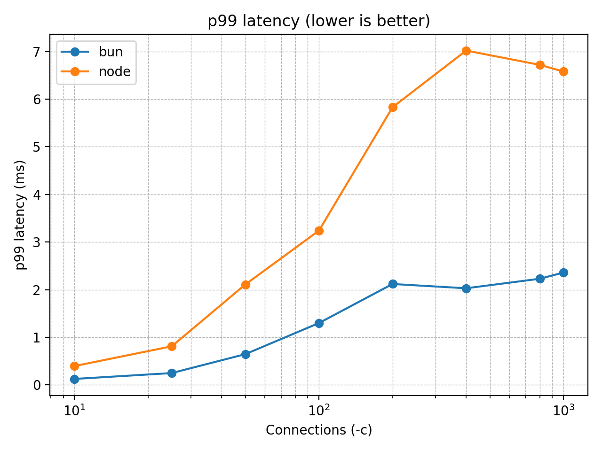
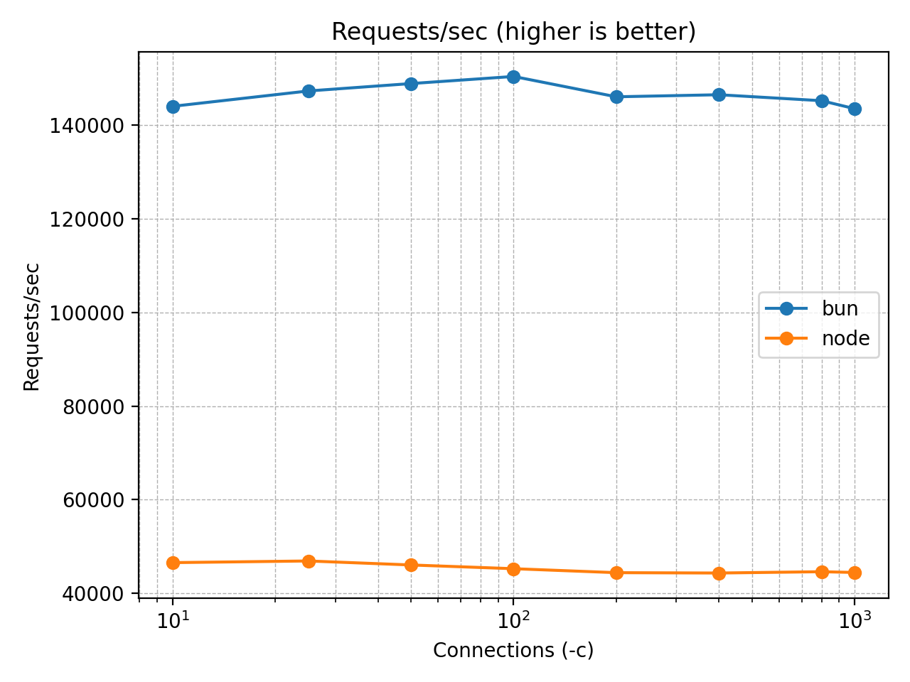

# No-as-a-Service (in Bun)

Ever needed a graceful and quick way to say “no”?

This fast, tiny API returns random, generic, creative, and sometimes hilarious rejection reasons — perfectly suited for any scenario: personal, professional, student life, dev life, or just because.

Built for humans, excuses, humor, and speed.

---

## API

**Base URL**

```sh
GET /no
```

```json
{
  "reason": "This feels like something Future Me would yell at Present Me for agreeing to."
}
```

Rate limited to 120 requests per minute, per IP.

---

## Running

```sh
cd no-as-a-service
bun install
bun start
# or
PORT=5000 bun start
```

The API will be live at:

```
http://localhost:3000/no
```

---

## Benchmarks

Using [wrk](https://github.com/wg/wrk) with the rate limiter disabled.
All benchmarks have been run with an increasing number of connections for 30 seconds an Apple M3 Pro CPU with 18GB RAM available.

| P99                                                         | RPS                                         |
| ----------------------------------------------------------- | ------------------------------------------- |
|  |  |

`bun`:

```
$ wrk -t12 -c1000 -d30s --latency http://localhost:$BUN_PORT/no
Running 30s test @ http://localhost:$BUN_PORT/no
  12 threads and 1000 connections
  Thread Stats   Avg      Stdev     Max   +/- Stdev
    Latency     1.62ms   81.75us   5.61ms   92.17%
    Req/Sec    12.35k     3.66k   22.31k    83.19%
  Latency Distribution
     50%    1.61ms
     75%    1.62ms
     90%    1.66ms
     99%    1.78ms
  4439538 requests in 30.10s, 822.74MB read
  Socket errors: connect 757, read 0, write 0, timeout 0
Requests/sec: 147476.79
Transfer/sec:     27.33MB
```

`node`:

```
$ wrk -t12 -c1000 -d30s --latency http://localhost:$NODE_PORT/no
Running 30s test @ http://localhost:$NODE_PORT/no
  12 threads and 1000 connections
  Thread Stats   Avg      Stdev     Max   +/- Stdev
    Latency     4.35ms    5.63ms 396.96ms   99.89%
    Req/Sec     4.75k     1.71k   20.40k    71.00%
  Latency Distribution
     50%    4.23ms
     75%    4.26ms
     90%    4.32ms
     99%    4.77ms
  1703463 requests in 30.10s, 499.25MB read
  Socket errors: connect 757, read 0, write 0, timeout 0
Requests/sec:  56585.78
Transfer/sec:     16.58MB
```

---

## Project Structure

```
no-as-a-service/
├── index.ts            # Bun API
├── rate-limiter.ts     # Rate limiter
├── reasons.json        # 1000+ universal rejection reasons
├── package.json
├── .devcontainer.json  # Dev Container setup
└── README.md
```

---

### Dev Container

If you open this repo in VS Code/GitHub Codespaces, it will automatically use the `.devcontainer.json` to set up your environment or ask you if you want to reopen it in a container.

---

## Projects Using No-as-a-Service

Here are some projects and websites that creatively integrate `no-as-a-service` to deliver humorous or programmatic "no" responses:

0. **[no-as-a-service](https://github.com/hotheadhacker/no-as-a-service)**  
   The original implementation of the project.

1. **[no-as-a-service-rust](https://github.com/ZAZPRO/no-as-a-service-rust)**  
   Rust implementation of this project.

2. **[CSG Admins](https://csg-admins.de)**  
   A system administration and gaming service hub using no-as-a-service to provide playful negative responses across some admin panels and commands.

3. **[FunnyAnswers - /no endpoint](https://www.funnyanswers.lol/no)**  
   A humor-focused API playground that includes a mirror or wrapper for no-as-a-service, perfect for developers exploring fun HTTP-based responses.

4. **[Gerador de Frases Aleatórias (pt-BR)](https://github.com/timeuz/frases-aleatorias)**
   Uma reinterpretação em Python com frases em português, frontend e novas categorias.

5. **[NoAsAnApp](https://github.com/omar-jarid/NoAsAnApp)**  
   A simple native Android app calling no-as-a-service to provide negative responses.

---

## Original Author

Created with creative stubbornness by [hotheadhacker](https://github.com/hotheadhacker)

---

## License

MIT — do whatever, just don’t say yes when you should say no.
